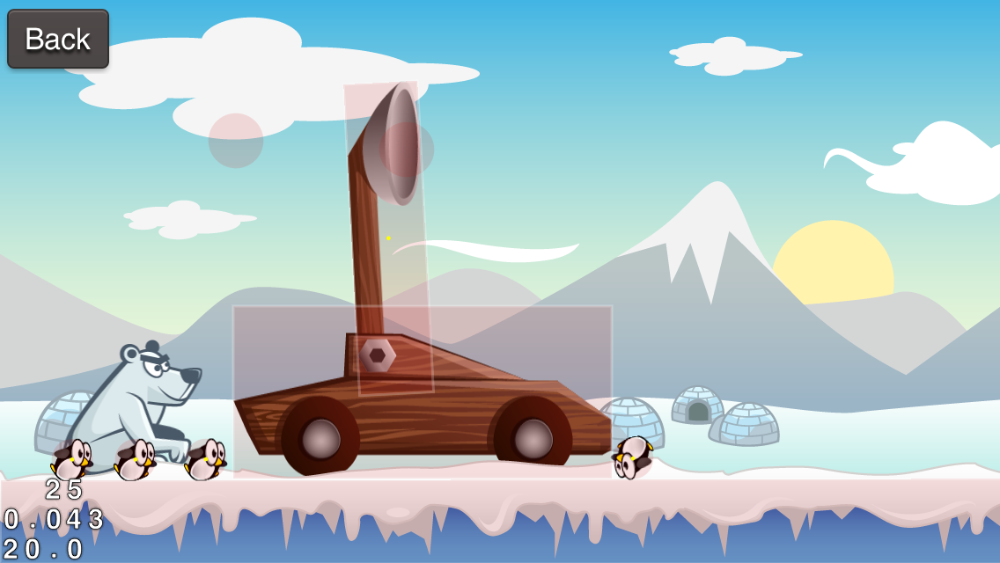
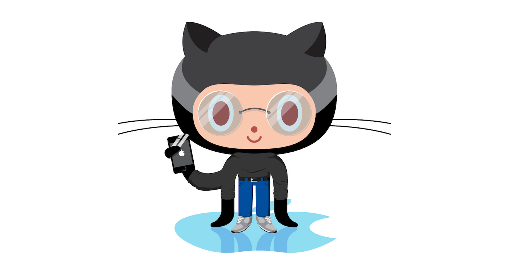
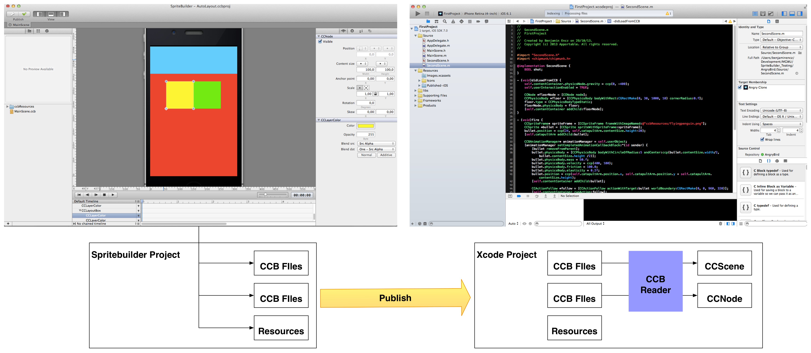

About this Tutorial
===================

If you have already installed SpriteBuilder, are familiar with the user
interface, and know how to create new projects you can skip directly to
[How to Manage Assets Using
SpriteBuilder](https://www.makeschool.com/tutorials/getting-started-with-spritebuilder/resources-spritebuilder/)
where you'll get set up with the art you need for this project.

This tutorial will guide you through building your very first
full-fledged mobile game with SpriteBuilder, a fantastic new tool
developed by Apportable. Throughout this process you will not only learn
the basics of the tool but will also get to see a lot of best practices
for common problems in mobile games.

The game we are going to build is a clone of the very popular game Angry
Birds. We will call it Peeved Penguins and this is what it will look
like:

You can access the code for the completed tutorial on
[GitHub](https://github.com/MakeSchool/Spritebuilder-Getting-Started)!

Installation
============

First, let's get our tools set up.

Go to [the Mac App Store to download
SpriteBuilder](https://itunes.apple.com/us/app/spritebuilder/id784912885?mt=12)
and download the latest version. Drag SpriteBuilder onto your dock from
your Applications folder so that you can easily access it.

Open SpriteBuilder. **Note that you need SpriteBuilder 1.4 for this tutorial.**

SpriteBuilder Basics
====================

SpriteBuilder's main goal is to provide a tool similar to Xcode's
Storyboard but for Cocos2D games.

SpriteBuilder is a visual editor that allows you to rapidly create
Cocos2D games. It enables you to create user interfaces, gameplay
scenes, and levels by dragging different components to different
*interface files* and arranging their positions. This can save a lot of
time compared to positioning every element on the screen in code.

Next to this core functionality SpriteBuilder includes tools to manage
your assets, create animations, audio effects, and particle effects. We
will get to these advanced features towards the end of this tutorial.

SpriteBuilder Workflow
======================

When you use SpriteBuilder for your game, you start by creating a new
SpriteBuilder project instead of an Xcode project. When creating a
SpriteBuilder project, SpriteBuilder will create and maintain an
embedded Xcode project for you.

Inside the SpriteBuilder project you will organize all the resources and
assets for your game. You will create interface files for the different
scenes in your game. The interface files are called .ccb files, named
after SpriteBuilder's predecessor CocosBuilder. SpriteBuilder also
allows you to create *code connections*. With code connections you can
create links between .ccb files and Objective-C classes. This means you
can add behavior to your game's objects in SpriteBuilder *and* in code -
we will discuss this concept in depth later.

In general your workflow with SpriteBuilder will look like this:

-   Create a new project in SpriteBuilder
-   Add images and other resources to your SpriteBuilder project
-   Create multiple .ccb files for the different scenes and objects in
    your game
-   Add code connections to extend the behavior of these scenes and
    objects
-   *Publish* your project in SpriteBuilder. This will update the Xcode
    project that is linked to your SpriteBuilder project
-   Run your game from Xcode

When you run your game from Xcode, a component called *CCBReader* will
read all the .ccb files from your SpriteBuilder project and create
cocos2D Scenes and Nodes out of them. Here's a short visualization of
how SpriteBuilder and Xcode projects work together:

Read on to learn how to create your first project!
