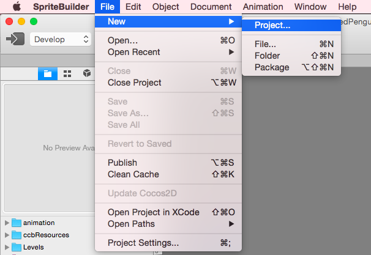
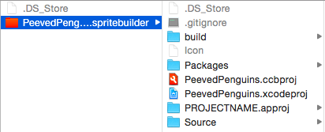
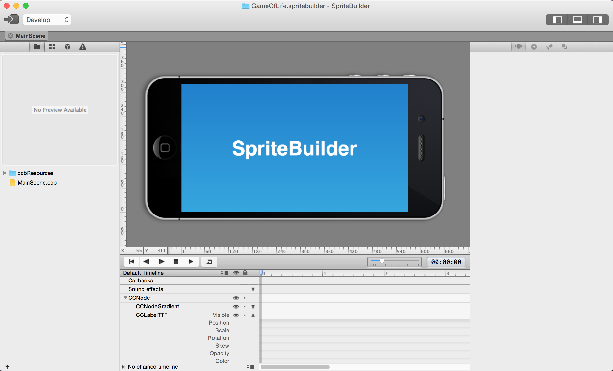
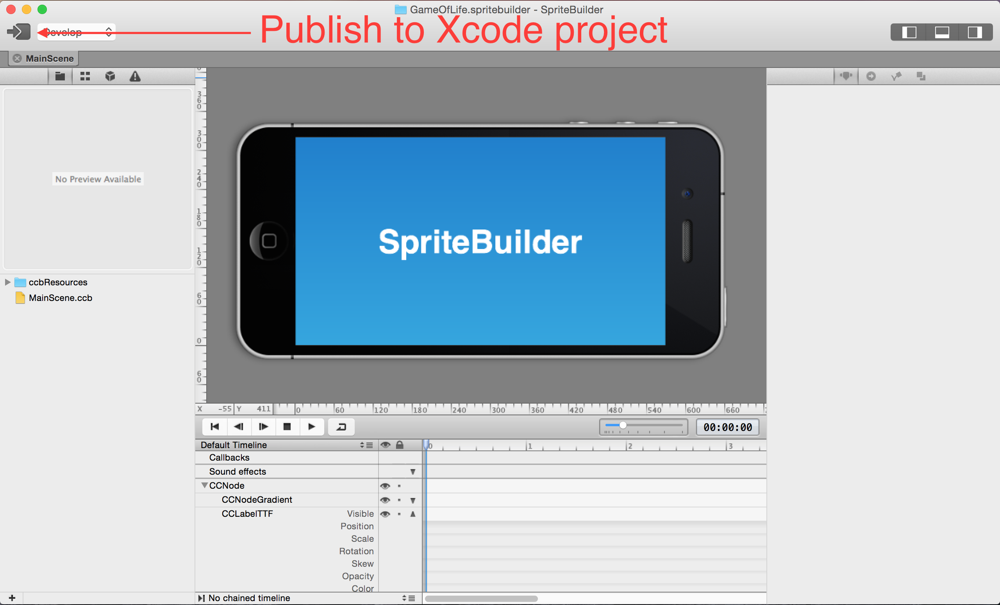

Let's start the work on our game by creating a new SpriteBuilder
project:

Name your new project “PeevedPenguins”. Once the project is created,
open Finder and take a look at the folder structure of your project. If
you can't find your project in Finder, search for it using Spotlight at
the top right of your screen. The folder structure should look something
like this:

SpriteBuilder created a new folder (PeevedPenguins.spritebuilder).
Inside it are a SpriteBuilder project (PeevedPenguins.ccbproj) and a new
Xcode project (PeevedPenguins.xcodeproj).

The default SpriteBuilder project comes with one scene (MainScene). Your
empty project should look like this:

Testing your setup
==================

Let’s make sure everything was generated correctly. Click the publish
button (on left side of the toolbar) in SpriteBuilder:

Now open PeevedPenguins.xcodeproj to view the project in Xcode. Run this
on the iPhone simulator and verify it shows the “SpriteBuilder” message:

Congratulations! Now you have run your first SpriteBuilder project and
you know your tools are working.
