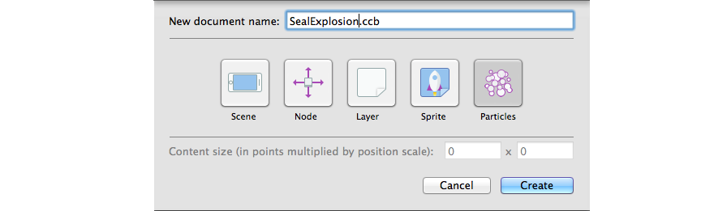
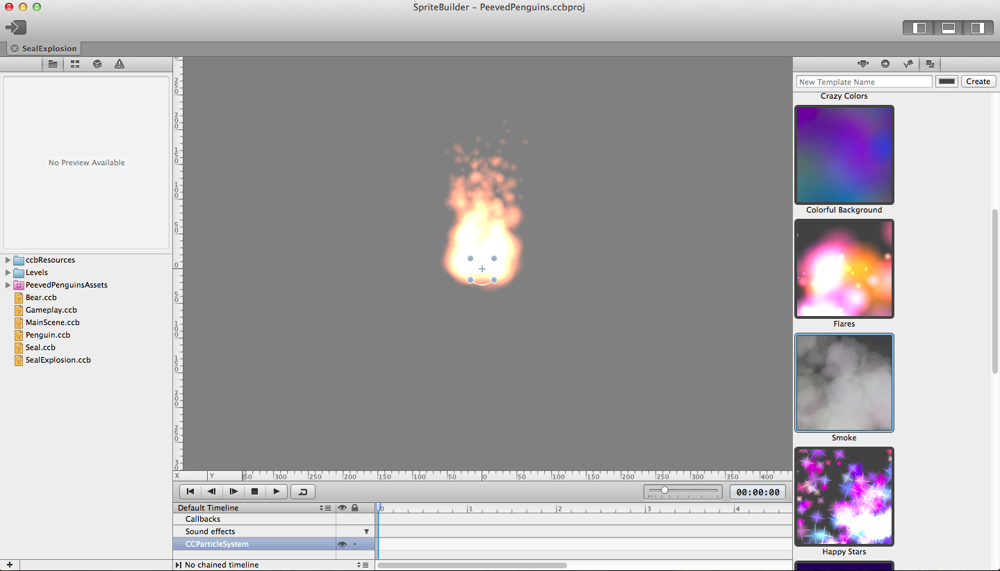
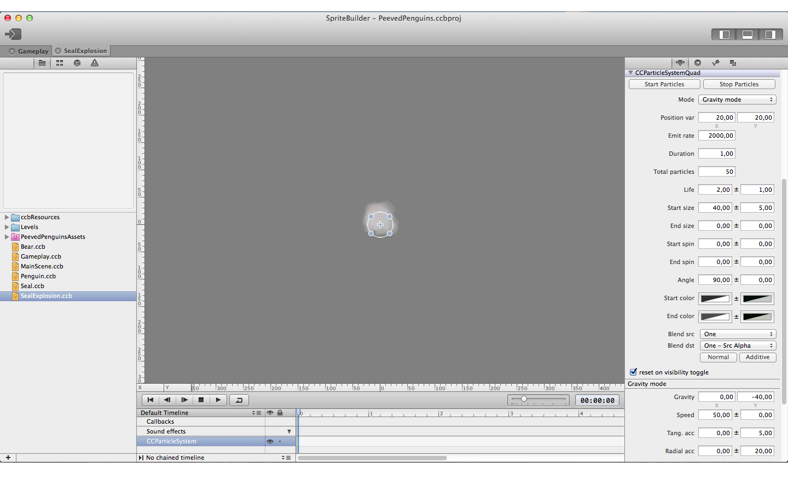
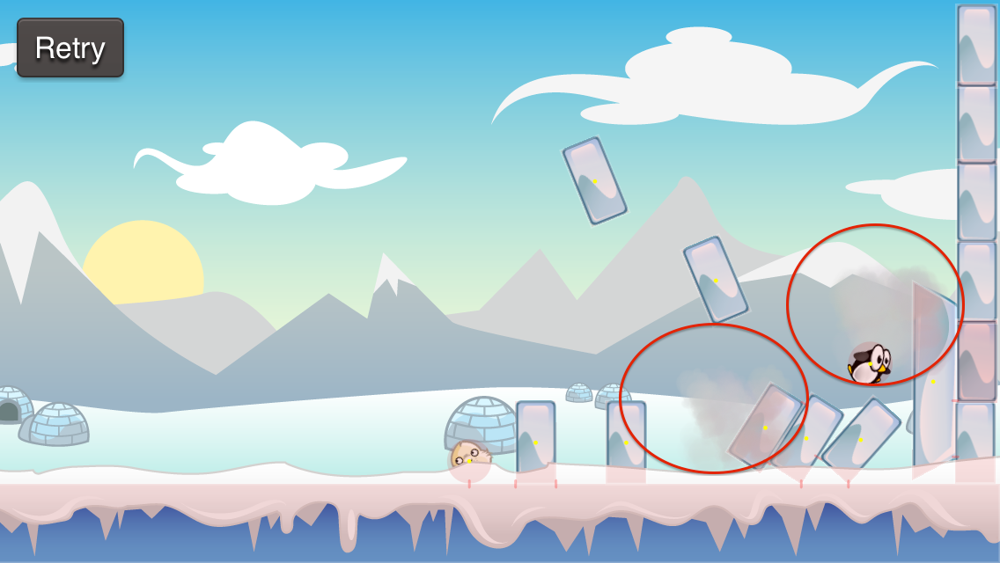
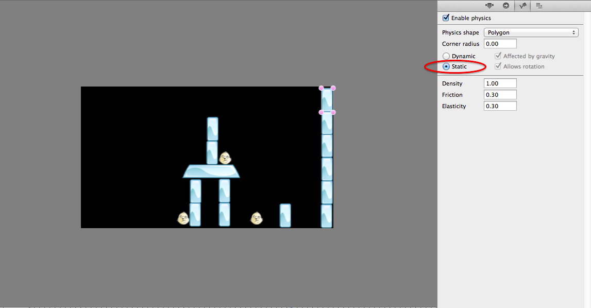

Now we are going to add an Angry Bird style particle effect whenever a
seal gets eliminated. SpriteBuilder has a great integrated particle
effect designer which we are going to use to define the style of our
first particle effect.

Create a new particle effect in SpriteBuilder
=============================================

In SpriteBuilder create a new file:

Now Spritebuilder will create and open a default particle effect:

When you open the rightmost tab in the right pane you will see a library
of other default particle effects. Often choosing an effect from this
library is a good starting point. Double-click the "Smoke" particle
effect - we will use it as base for our custom effect.

In the first tab you can see & modify all properties of a particle
effect. With a little effort you can turn the smoke template into one
that looks very similar to the one in angry birds. You can either copy
our values from the image below or create a complete own particle
effect:

If you don't feel like building your own particle effect now, [you can
download the one we
prepared](https://s3.amazonaws.com/mgwu-misc/Spritebuilder+Tutorial/SealExplosion.ccb)
and add it to your project. Add it by copying it into the *SpriteBuilder
Resources* folder inside your SpriteBuilder project.

Feel free to spend as much time as you like playing around with
different values and options as we will not discuss them in detail now.
You can use the *Start Particles* and *Stop Particles* buttons on the
right pane to manually run your particle effect. Before moving on to the
next section you should have your particle effect set up and your
SpriteBuilder project published.

Run the particle effect when a collision occurs
===============================================

Open *Gameplay.m* in Xcode. We are now going to add some code that runs
our particle effect whenever a seal gets eliminated.

Extend our *sealRemoved* method to look like this:

    // load particle effect
    CCParticleSystem *explosion = (CCParticleSystem *)[CCBReader load:@"SealExplosion"];
    // make the particle effect clean itself up, once it is completed
    explosion.autoRemoveOnFinish = TRUE;
    // place the particle effect on the seals position
    explosion.position = seal.position;
    // add the particle effect to the same node the seal is on
    [seal.parent addChild:explosion];

    // finally, remove the destroyed seal
    [seal removeFromParent];

The most is explained in the comments of this snippet. We load a
particle effect and place it on the seals position directly before we
remove the seal from the scene. Particle effects start
running automatically, as soon as they are added to a scene.

When you run your game and eliminate seals you should see them go up
into smoke:

As you can see in the screenshot above, I have added some static ice
blocks to the right end of my level, to avoid penguins and seals leaving
the level:

You can do this, too. It increases the chance of seals being eliminated.

Well done! Now you know how to create particle effects and make them
play when certain events in your game occur.
