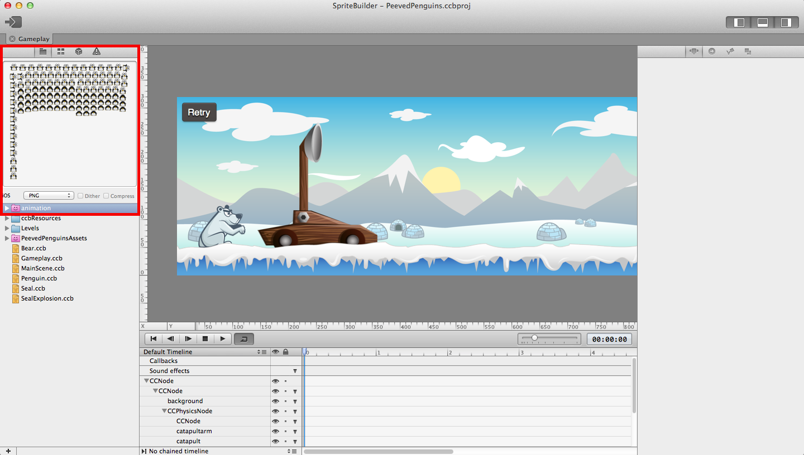
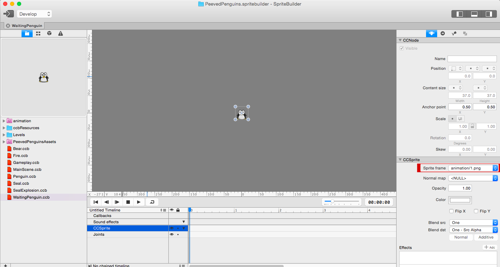
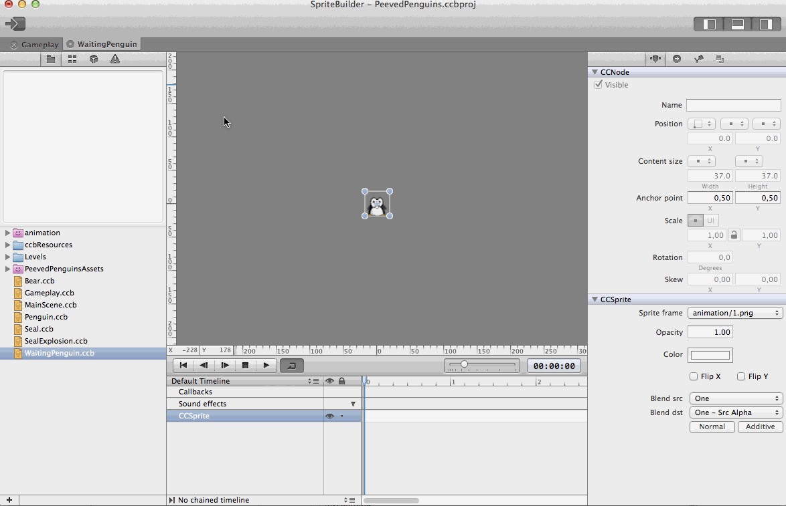
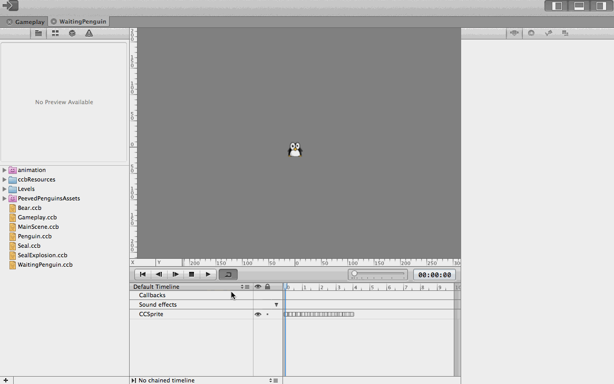
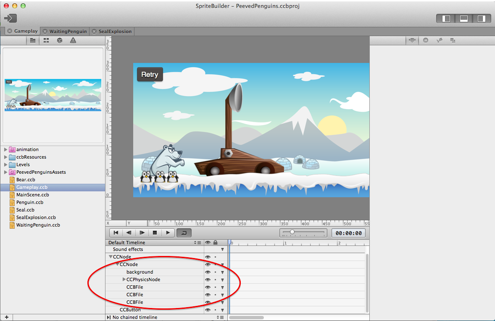
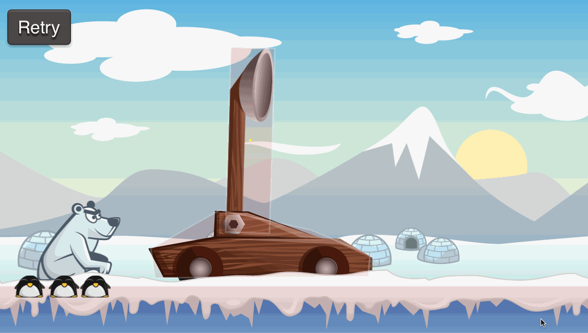
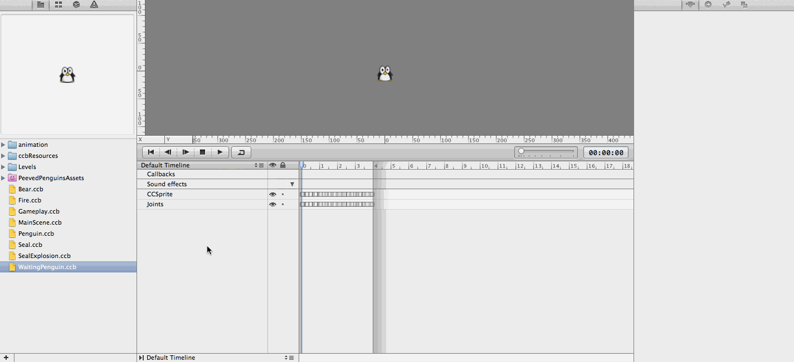
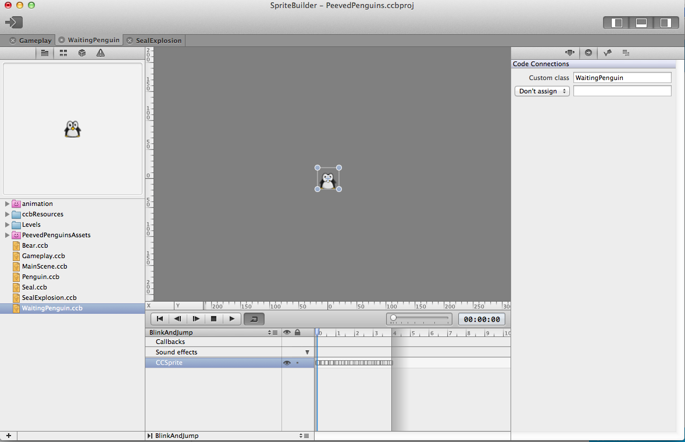
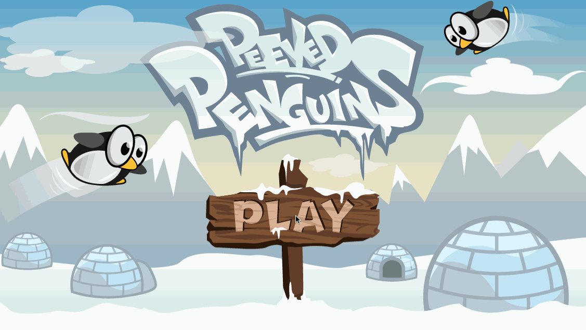

In an early chapter you already learned how to create an animation using
the timeline features of SpriteBuilder (remember the bear?). In this
chapter you will learn how to create animations with a series of sprite
files. We will animate penguins while the sit around the catapult,
waiting to be turned into bullets.

Add the resources
=================

Download these
[resources](https://s3.amazonaws.com/mgwu-misc/Spritebuilder+Tutorial/animation.zip),
unzip them and drag the *animation* folder to your SpriteBuilder
project.

Once you have added the folder to your project turn it into a smart
sprite sheet by using a right-click on the folder and selecting *Make
Smart Sprite Sheet*. Hit the publish button so that SpriteBuilder
creates a texture for your sprite sheet. When you are done your project
should look like this:

Create a new interface file
===========================

Next, create a new interface file in SpriteBuilder. Call it
*WaitingPenguin.ccb* and choose *Sprite* as the root node.

Once the file is created, open it and select the first animation frame
to be the default frame of the new sprite (*animation/1.png*):

Setup the animation
===================

SpriteBuilder provides a simple way of setting up frame based
animations:

-   Select the sprite you want to apply the animation to
-   Select all the relevant images from the resource pane (left)
-   Right-click on the selected images and choose *Create Keyframes from
    Selection*

Depending on the amount of frames you will have to wait a couple of
seconds. Then SpriteBuilder will add all images to your timeline. Here's
a short visual walkthrough:

Now you have an animated penguin! Next, let's reduce the length of the
timeline. The animation is about 4 seconds. You also need to chain the
timeline to itself, so that the penguins blink and jump in an endless
loop:

Now publish your SpriteBuilder project before adding the waiting
penguins to the *Gameplay* scene.

Add Penguins to Gameplay Scene
==============================

Drag *WaitingPenguin.ccb* to the *Gameplay.ccb* to add three waiting
penguins. Make sure that the waiting penguins are children of the
content node (otherwise they won't scroll away with the scene):

Now publish and run your game. You should see the three penguins
blinking and jumping next to the catapult:

Unsynchronize the animations
============================

The animation looks pretty good - however it seems odd that all penguins
perform them at the exactly same moment. This happens because our
timeline has *Autoplay* activated at the moment, which means that the
animation starts as soon as the object enters the screen. We are going
to change that, by triggering the start of the animation in code,
instead of using the *Autoplay* setting of the timeline.

As of SpriteBuilder 1.1 we need to have at least one Timeline that has *Autoplay* activated. That means we need to create another empty Timeline before we can turn off *Autoplay* for the current one.

Create a new empty Timeline, rename the timeline with the animation from *Default Timeline* to *BlinkAndJump* and
deactivate *Autoplay* for it:

Also set a custom class called *WaitingPenguin*, so that we can add code
to kick of the animation manually:

Now publish your project and open Xcode!

Add code to run an animation
============================

Create a new class called *WaitingPenguin* and make it a subclass of
*CCSprite*.

Now we are going to implement the *didLoadCCB* method where are going to
generate a random number, that will determine how long we are going to
wait before starting the animation:

    - (void)didLoadFromCCB
    {
        // generate a random number between 0.0 and 2.0
        float delay = (arc4random() % 2000) / 1000.f;
        // call method to start animation after random delay
        [self performSelector:@selector(startBlinkAndJump) withObject:nil afterDelay:delay];
    }

After that we only need to implement the method to start the animation:

    - (void)startBlinkAndJump
    {
        // the animation manager of each node is stored in the 'animationManager' property
        CCAnimationManager* animationManager = self.animationManager;
        // timelines can be referenced and run by name
        [animationManager runAnimationsForSequenceNamed:@"BlinkAndJump"];
    }

Each timeline can be started referencing it by it's name.

Now build and run the project again. The animation should look a lot
more natural now:

Well done! You now have mastered sprite animations in SpriteBuilder.
