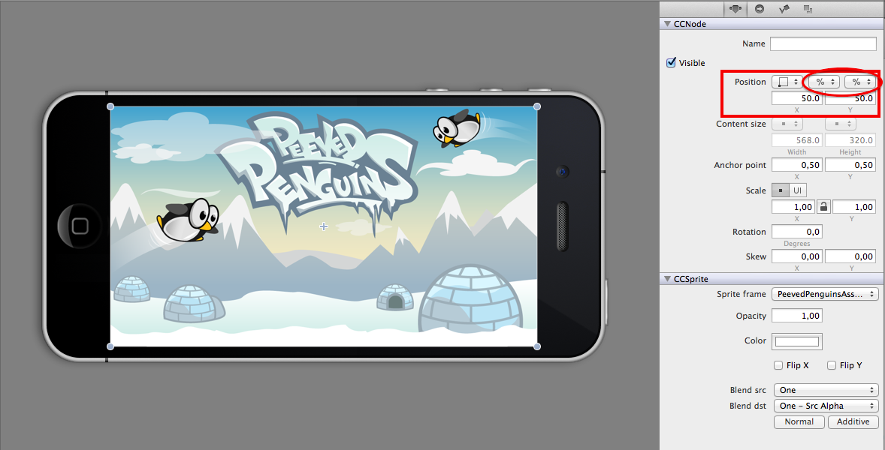
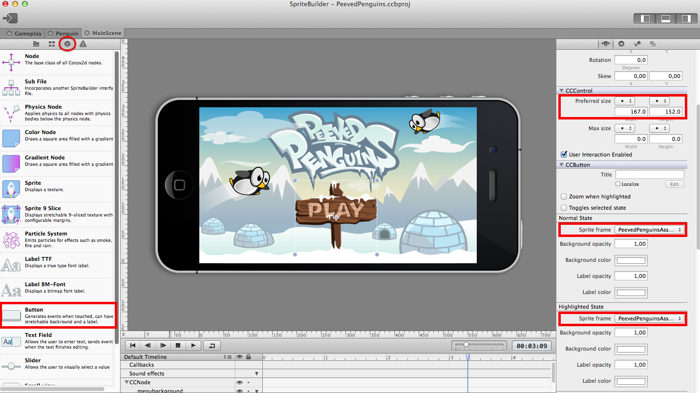
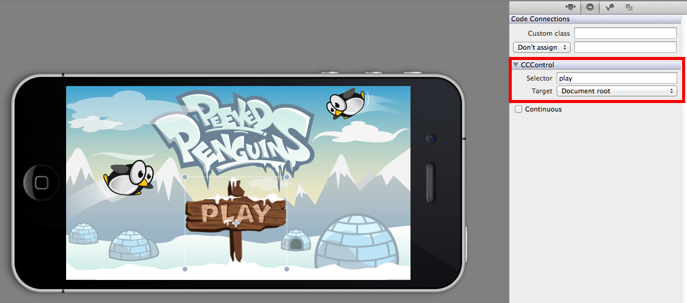
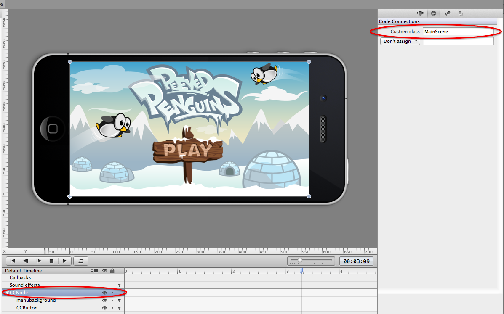
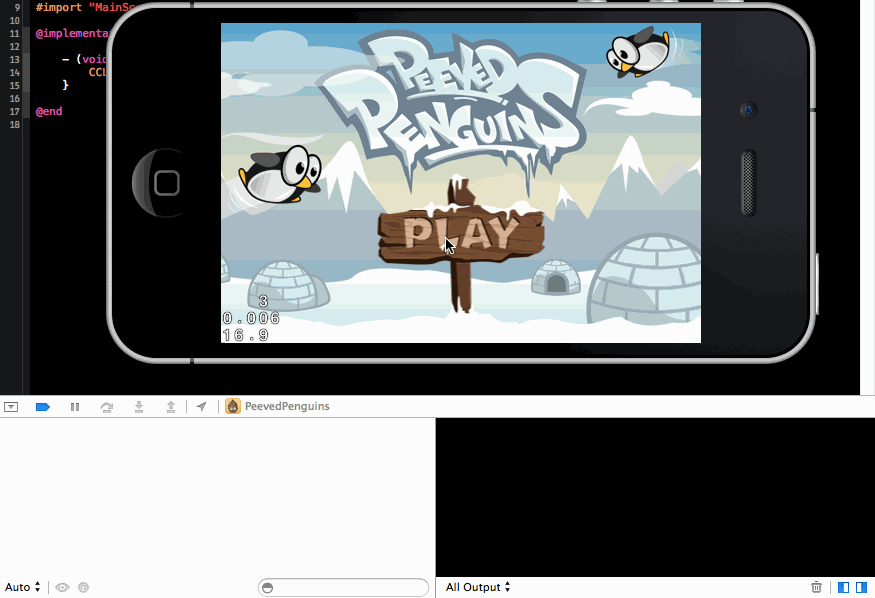
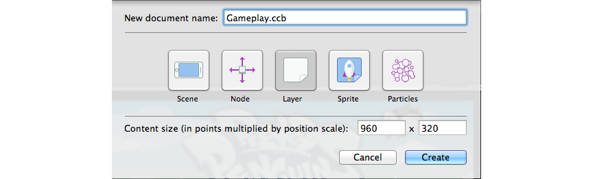

Now we are going to setup the start menu. That start menu will lead us
to the gameplay scene that we are going to implement in the next
chapter.

Remove everything from MainScene.ccb
====================================

We are going to use the MainScene for our main menu so remove the label
and the background image from the project template.

Set up the background image
===========================

The art provided for the menu background is designed to work for 3.5
inch (\<= iPhone 4) and 4 inch (\>= iPhone 5) screens.

Drag *menubackground.png* to the screen. Center the background image on
the screen by keeping the default anchor point (0.5, 0.5) and setting
the position *relative to % of parent container* for x and y and
choosing 50% for each:

Positioning the sprite this way ensures it will always be centered -
independent of the screen size.

Add the play button
===================

Open the *Node library view* on the left pane and drag a *Button* to the
stage. Now you need to change a couple of settings, so select the
button. On the bottom of the right panel you can choose images for
different button states. For both *Normal State* and *Highlighted State*
select the *button.png* image. Don't worry if the button looks distorted
now; you need to change another setting: *Preferred Size* should be
(167.0, 152.0). The preferred size needs to be 50% of the image size for
retina images. As a last step delete the "title" of the button:

Link a method to the play button
================================

We want our game to start when the play button is pressed. So next you
need to link an action to the play button being pressed. Select the play
button and open the *second* tab on the right panel. Set the value of
*selector* to "play". This is the name of the method that will be
invoked when the button is pressed. For the *Target* select "Document
root". This will cause the method to be invoked on the root node of this
.ccb file:

Now there's one last thing to check before we open Xcode and add some
code to be executed when the play button is pressed. I just explained
that the "play" method will be executed on the root node of this .ccb
file. So let's check that we actually have an Objective-C class linked
to the root node of this .ccb file.

Select the root node, CCNode, on the timeline then open the second tab
on the right panel again and check the value of the *Custom class*
field:

The value should be *MainScene*. This value is set by SpriteBuilder by
default. Alltogether this means: *When the play button is pressed, the
method 'play' of the class 'MainScene' is invoked.*

Finally, publish this project in SpriteBuilder so that the changes are
pushed to your Xcode project!

Add code to the play method
===========================

Now it's time to open Xcode and implement the method we have just
linked. Open *MainScene.m* and add this dummy implementation of the play
method:

    - (void)play {
        CCLOG(@"play button pressed");
    }

Now you are ready to run the project. Whenever you touch the play button
you should see "play button pressed" appear in the console:

Create the Gameplay Scene
=========================

Now we need to create a new scene. This is where the actual gameplay
will take place (stay patient, you're only chapter away from
implementing all the fun!)

Go back to your SpriteBuilder project. Create a new File titled
Gameplay. Select *Layer* as the root node type. Set the size to 960x320:

Hit the publish the button in SpriteBuilder.

Add a transition
================

Now open Xcode again and modify the *play* method in *MainScene*. When
the play button is pressed we want the Gameplay to be loaded and be
displayed as the current scene. This is quite simple. Use *CCBReader* to
load the gameplay. Use *CCDirector* to replace the current scene with
the loaded one:

    - (void)play {
        CCScene *gameplayScene = [CCBReader loadAsScene:@"Gameplay"];
        [[CCDirector sharedDirector] replaceScene:gameplayScene];
    }

Save and Run. Now when you hit the play button a black screen should
appear. This is our empty game.

Let's bring it to life!
