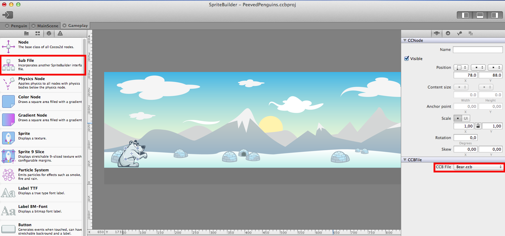
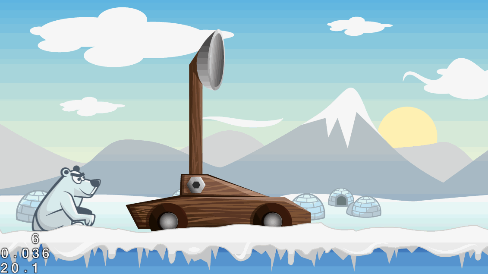
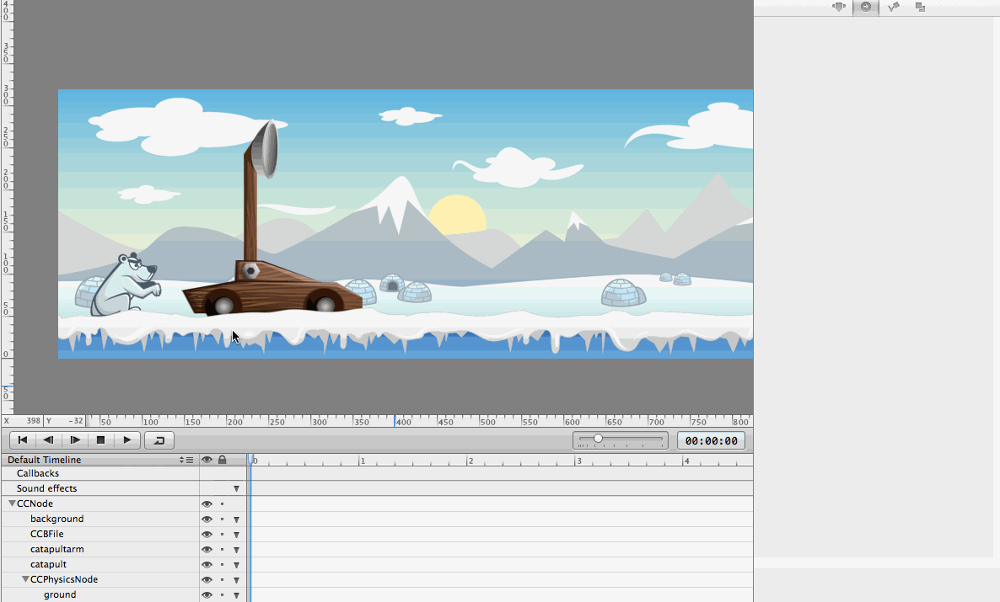
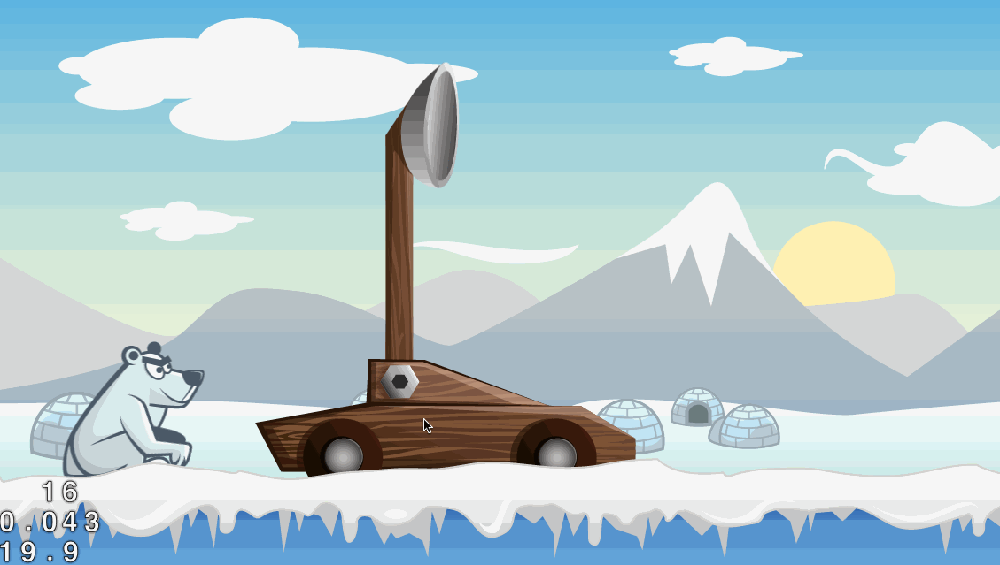

Time to grab your favorite hot beverage - we're diving right into the
implementation of the core gameplay!

Make it pretty
==============

Let's start by dragging some art into our new *Gameplay*.ccb file. Start
by dragging *background.png* to the stage. Set position and anchor point
to (0,0), this will ensure the background is nicely aligned with the
scene borders.

Next, let's add the bear we created previously. Spritebuilder lets you
include .ccb files in other .ccb files. This is a *super* powerful
feature, and we will make extensive use of it. Drag a *Sub File* Node
from the *Node Library* to the stage. Select *bear.ccb* as *CCB File*:

Now the bear sprite, including the animation we defined earlier, is part
of the Gameplay scene!

Now add the *ground.png* to the stage. Set position and anchor point to
(0,0).

Finally build the catapult by dragging *catapult.png* and
*catapultarm.png* to the stage. The draw order is top to bottom so if
you can't see one of your assets it is probably under something. Note
that you can change the z-order of the objects in your scene by changing
the order in the timeline at the bottom of the screen.

Now publish your SpriteBuilder project and run it in the Simulator.
After the hitting the play button you should see something similar to
this:

Shoot some penguins
===================

We are first going to implement a simple shooting mechanism. In Cocos2D,
physics objects can only be children of physics nodes. Since the
penguins we are shooting will engage in the physics simulation, we are
now going to add a physics node to our scene.

**In Spritebuilder:**

Drag a *PhysicsNode* from the *Node Library* to the scene and position
it at (0,0). We are going to implement the penguin shooting in code so
we need to set up some code connections.

First, set the custom class of the *Gameplay* root node, CCNode, to
"Gameplay". Then set up a member variable link for the CCPhysicsNode. We
want to assign it to *Doc root var* with the variable name
"\_physicsNode". This will link this physics node to a variable called
"\_physicsNode" of the class "Gameplay":

Now we will be able to access the physics node from code. That will
allow us to add the fired penguins to the scene.

Now create another code connection - all on your own. We want the
*catapultarm* to be accessible through a variable called *\_catapultArm*
in the *Gameplay* class.

**In Xcode:**

Now we will need to switch to Xcode to implement a firing method. First,
create a new class *Gameplay*. That class needs to be a subclass of
*CCNode*. When saving the class, make sure it is in the *Source* folder
of your project. Add the member variables *\_physicsNode* and
*\_catapultArm* to *Gameplay.m*:

    @implementation Gameplay {
        CCPhysicsNode *_physicsNode;
        CCNode *_catapultArm;
    }

The simple shooting mechanism will be triggered whenever a player
touches the screen. We are going to implement this touch handling in
code.

Add these three methods to *Gameplay.m* to activate touch handling,
process touches and launch penguins:

    // is called when CCB file has completed loading
    - (void)didLoadFromCCB {
        // tell this scene to accept touches
        self.userInteractionEnabled = TRUE;
    }

    // called on every touch in this scene
    - (void)touchBegan:(CCTouch *)touch withEvent:(CCTouchEvent *)event {
        [self launchPenguin];
    }

    - (void)launchPenguin {
        // loads the Penguin.ccb we have set up in Spritebuilder
        CCNode* penguin = [CCBReader load:@"Penguin"];
        // position the penguin at the bowl of the catapult
        penguin.position = ccpAdd(_catapultArm.position, ccp(16, 50));

        // add the penguin to the physicsNode of this scene (because it has physics enabled)
        [_physicsNode addChild:penguin];

        // manually create & apply a force to launch the penguin
        CGPoint launchDirection = ccp(1, 0);
        CGPoint force = ccpMult(launchDirection, 8000);
        [penguin.physicsBody applyForce:force];
    }

The explanation for this code is within the comments. However, it is
surprisingly simple. When you run your app now and touch the screen, you
should see penguins flying across the landscape:

