Shooting penguins is fun. Colliding with seals and ice blocks is even
more fun!

Time to learn how to create and load levels.

Setup the ground
================

The levels we are going to load minutes from now need to stand on a
stable ground in the Gameplay scene. So the first thing we will do is to
add the *ground* to the *CCPhysicsNode* and setup a physics body for it.

Drag the *ground* node onto the *CCPhysicsNode* in the timeline. After
that your arrangement should look like this:

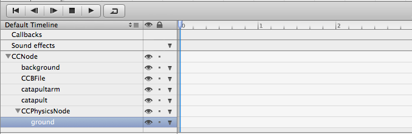

With the ground selected, open up the physics tab in the properties pane
(third tab in right pane). Enable physics and set it to "static". Static
is used for objects that never move and are not affected by gravity or
other forces.

Since our ground is not flat, we need to contract it’s bounds a bit.
Otherwise we would have floating objects in some places. Do this by
moving the pink corners down a few pixels.

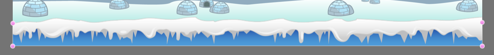

Now we have a solid ground that will stop objects from falling into
oblivion.

Set up a level loading mechanism
================================

Now we get to solve our first little puzzle. Problem: we want to be able
to have an unlimited amount of levels in our game. Therefore we don't
want the game mechanics (shooting, collision detection, etc.) to be part
of the levels. Otherwise we would be in big trouble if we wanted to
change them, we'd need to apply the changes to every level.

This means we are not going to add the information about a level
directly to our *Gameplay.ccb*. A better solution is to define an area
in the *Gameplay.ccb* that is level specific and to load the level data
into that area.

**Add a Level Node**

Drag a new CCNode to your timeline; **add it as a child to the
CCPhysicsNode** because the levels we will be loading will contain
physics objects (every physics object in Cocos2D needs to be a child of
a CCPhysicsNode).

Apply the following dimensions: x:469, y:47, width:490, height:275:

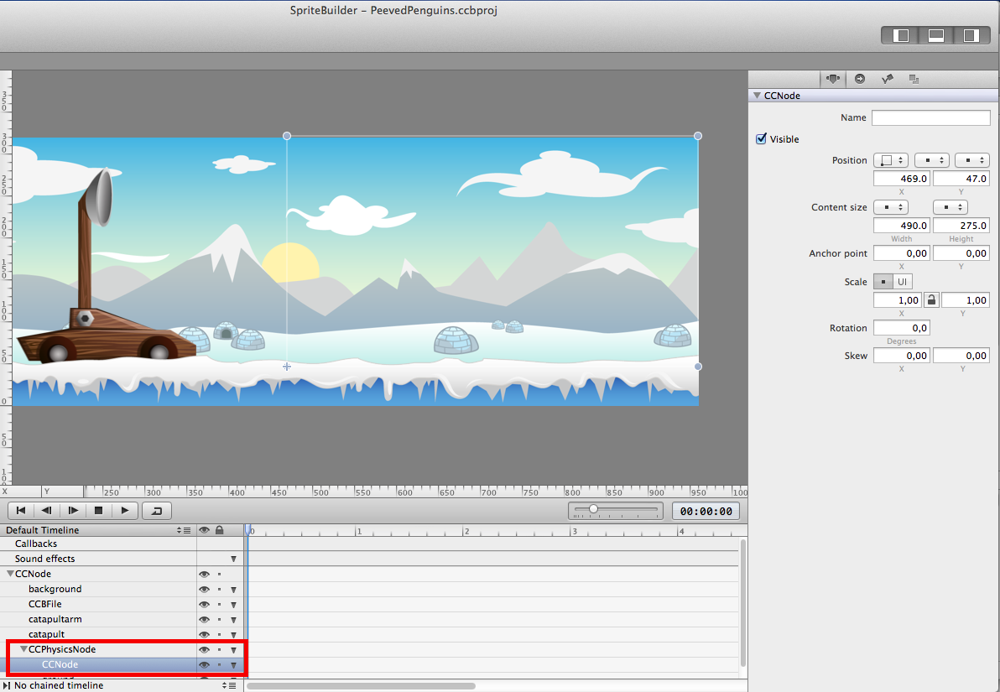

This node will be the container for the levels we will be loading later
on. The actual loading will happen in code, so create a code connection
to make the *levelNode* accessible from the *Gameplay* class. Call the
variable "\_levelNode".

**Create a Level**

In your Spritebuilder project create a new folder called "Levels".
Inside that Folder create a new Interface File. Call it "Level1", as SpriteBuilder document type choose "Layer" and set it's size to (490, 275).

Your first level and the folder structure should look like this:

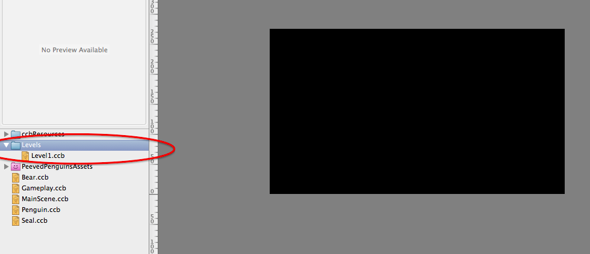

Congratulations, this is your first level! Now add some content. Pull
multiple *seal.ccb* files and different images of ice blocks
(*tallblock.png*, etc) to this scene. Be sure to place some items at the
very left edge of the level (this way they will be visible when we load
the level - even before we have implemented a scrolling mechanism). Your
scene could look somewhat like this:

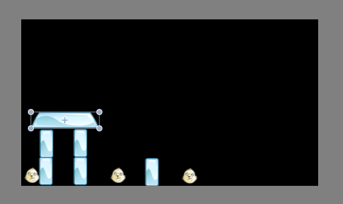

**Add level loading code**

Now we are going to add some surprisingly simple level loading code.
Open *Gameplay.m* in Xcode.

Add a member variable within the @implementation block (where you added
the *\_physicsNode* variable):

      CCNode *_levelNode;

and add these lines to the end of the method *didLoadFromCCB*:

    CCNode *level = [CCBReader load:@"Levels/Level1"];
    [_levelNode addChild:level];

This will load *level1* and add it as a child to the levelNode. When you
run your game you should see your level appear in the Gameplay scene:

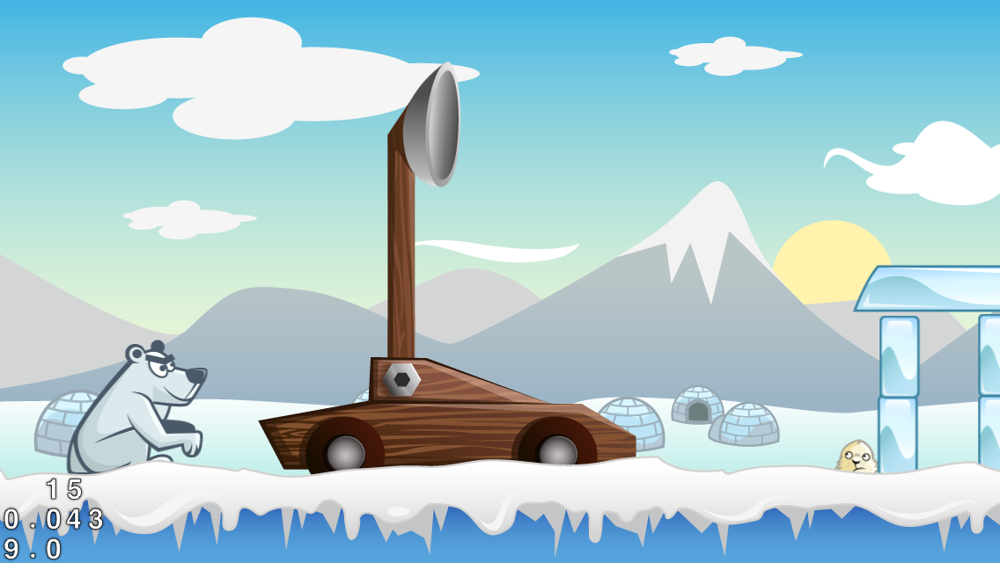

Scrolling the scene
===================

Now that we can shoot penguins, let's improve the experience by
following the penguin while it flies across our level. Luckily cocos2D
provides a very convenient way of doing this.

Have you used CCActions before? CCActions provide a lot of convenience
methods to implement animations, movements, scaling, etc. in code.
Performing a CCAction is always a two-step process:

-   setup a CCAction with a couple of parameters (e.g scale, duration,
    etc.)
-   tell any CCNode to run that CCAction

To implement our camera that follows the penguin we will use an action
called *CCActionFollow*. The usage is very simple. You define a CCNode
that shall be followed; optionally you can also define world boundaries,
so that the camera does not scroll outside of your background image.

Add these lines to the end of the *launchPenguin* method in
*Gameplay.m*:

    // ensure followed object is in visible are when starting
    self.position = ccp(0, 0);
    CCActionFollow *follow = [CCActionFollow actionWithTarget:penguin worldBoundary:self.boundingBox];
    [self runAction:follow];

We are telling the Gameplay scene to act as a camera following the
penguin. We also say that the camera shall not leave our scene by using
the bounding box of the scene to define the world boundaries.

Run your game again and you'll see the camera following the penguin:

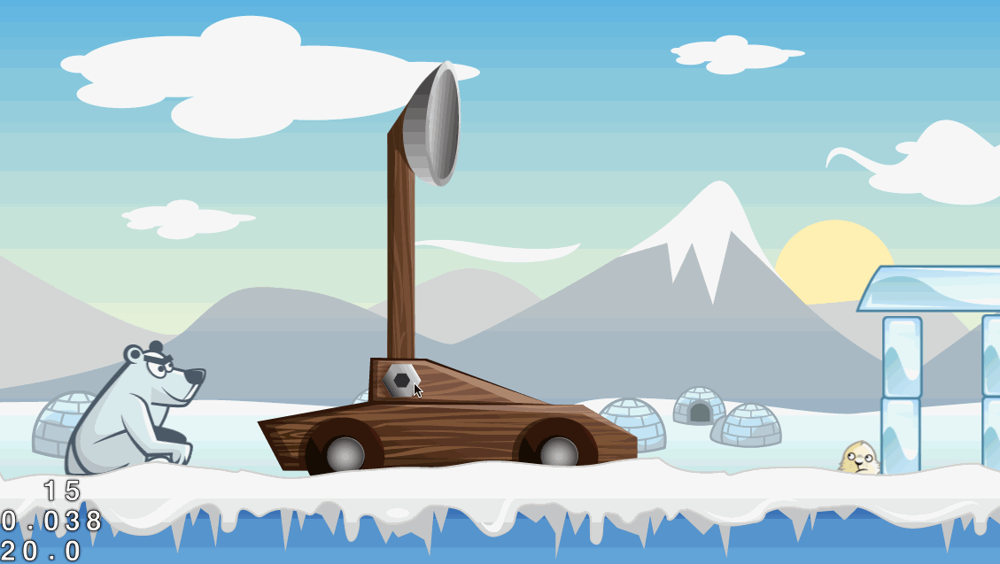

As you can see the penguin does not collide with the ice blocks yet.
That's because they aren't physics objects at the moment. Let's change
that in our next step!

Whack the ice blocks
====================

Open your SpriteBuilder project and open *Level1.ccb*. Select each ice
block and enable physics for it. Remember that you can drag the pink
dots to change the form of the physics body. You should do this if you
use the tapered block in your level:

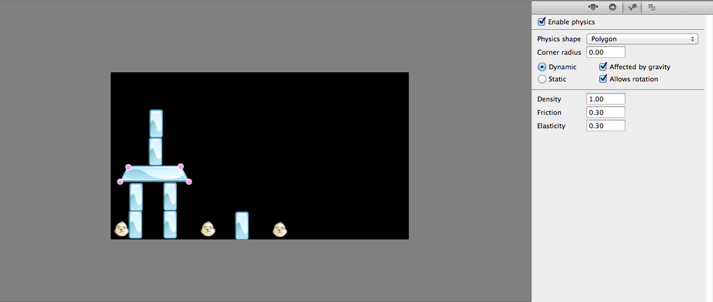

Once you're done; publish your SpriteBuilder project and run it again.
You now should be able to collide with the ice blocks:

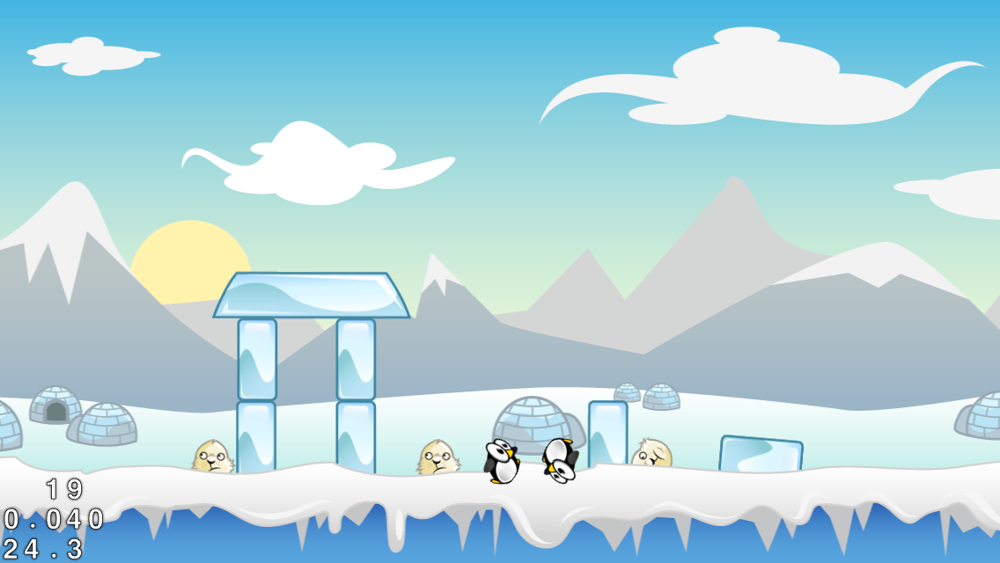

Adding a level reset
====================

Now that we can destroy the level, it also would be great to be able to
restart easily. Let's add a button to reset the level.

Open *Gameplay.ccb* in SpriteBuilder. Drag a button to the left top of
the screen. Set a title and a code connection for the button.

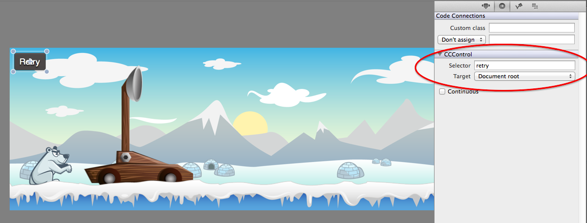

The implementation is pretty easy. We are just going to reload the
entire scene utilizing the *CCDirector*. Add this implementation to
*Gameplay.m*:

    - (void)retry {
        // reload this level
        [[CCDirector sharedDirector] replaceScene: [CCBReader loadAsScene:@"Gameplay"]];
    }

Great! Now run the app and make use of the new "Retry" button. Can you
foresee what problem is going to come up? Right! The button is part of
the Gameplay scene that is scrolling to follow the penguin. This means
that the button scrolls of the screen. Yikes!

**Before reading on, try to think of possible solutions for this
problem. It is important to come up with some ideas when you face this
kind of hurdle.**

Fixing the level reset, part 1
==============================

Ok. I hope you've spent some time and came up with some ideas. Here's
our approach. We're going to restructure the Gameplay scene by adding a
content Node. All gameplay action will be added to the content Node, all
UI elements will be added on top of that content Node, directly to the
Gameplay scene.

Open *Gameplay.ccb* and add a CCNode at position (0,0). This will be our
content node. Now restructure the scene in the timeline. Drag *all Nodes
except the button* onto the content node to make them a child of the
content node. When you're done your scene hierarchy should look like
this:

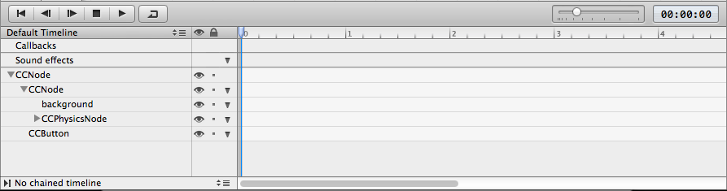

OK, you're halfway through this. We've restructured the scene but this
doesn't change anything yet. We're still scrolling past the restart
button when we scroll through the Gameplay scene.

**What is the second change we need to put in place to keep the button
on the top left, while following the penguin? Once again, try to come up
with your own solution.**

Fixing the level reset, part 2
==============================

Figured it out? Right, we need to scroll the contentNode instead of the
Gameplay scene! Add a code connection for the contentNode, so that we
can access it from *Gameplay.m*.

When the code connection is set up, open *Gameplay.m* in Xcode. Add the
member variable you need for the code connection. Then modify the actual
scrolling code. Make the new content node perform the action instead of
the Gameplay Scene. Your code for setting up and performing the action
should now look like this:

    // ensure followed object is in visible are when starting
    self.position = ccp(0, 0);
    CCActionFollow *follow = [CCActionFollow actionWithTarget:penguin worldBoundary:self.boundingBox];
    [_contentNode runAction:follow];

Now the content Node is scrolling and not the complete Gameplay scene.
Since the content Node is only used to structure the scene and doesn't
have a content size, we still use the bounding box of the Gameplay scene
(*self*) to define the world boundaries.

If you run the game now, the button should stay in the top left corner
and allow you to easily restart the level at any time.

Congrats! This is starting to look like an actual game. In the next
chapter you are going to learn how to implement a great, physics based
shooting mechanism, so stay tuned!
