Now things are going to get real. We are going to implement a
shooting mechanism. First I'll get started with a short introduction to
some of the basics you'll need for this step.

What are joints and why do I need them?
=====================

In this step we are going to turn the catapult and the catapult arm into
physic objects. Unlike the other physics objects we have in our game at
the moment, the catapult consists of two parts that we will need to keep
together. Two physics objects can be connected to each other using joints.

Don't understand why you need joints yet? I'll give you a showcase. Open
*Gameplay.ccb* and turn catapult and catapult arm into physics objects.
Note that you can add edge points to the shape of a physics body by
clicking on a line and dragging a point out:

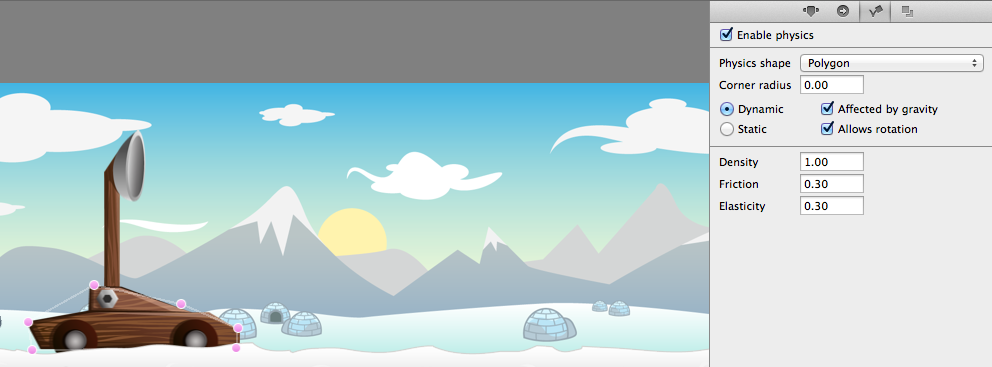

Please be sure that the catapult arm and the catapult are children of
your physics node. Every physics object in SpriteBuilder needs to be
under a physics node:

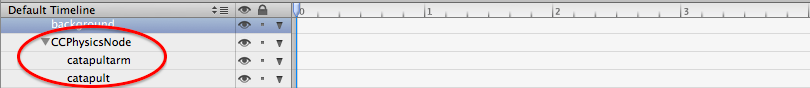

Now publish and run. After a couple of seconds your scene will look
similar to this:

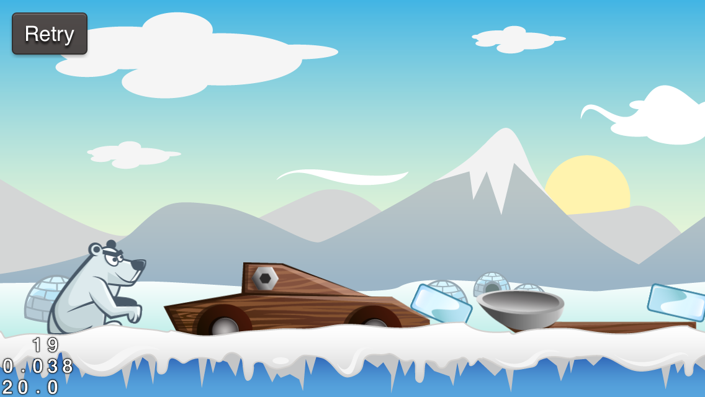

The catapult falls apart because we aren't using joints to keep it
connected! The good news is, that since SpriteBuilder 1.1, we can create joints directly in the editor, making the next step really easy.

Setting up your first joint
===========================

First, let's revise the physics body for the catapult. Make the catapult
(not the arm!) a **static body** in the right panel. We don't want the
catapult to move around through the scene.

Now, let's add the joint. Three different joints are available in the Node Library (the third tab in the left panel). Right now we want to use *Physics Pivot Joint*. That type of joint connects to physics bodies at a single point. Drag the joint to the position where you want to connect the two physics bodies. Once you dragged the physics joint to the stage you will see two dots below the joint. Click into each of these dots and drag the mouse pointer to the physics object that shall be connected by this joint:

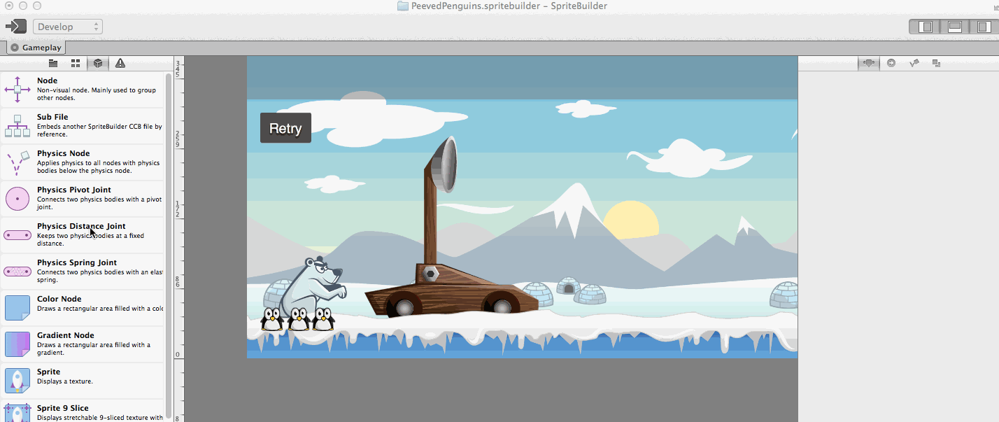

This way you set up the catapult and the catapult arm to be connected in one single point. You can also change which bodies are connected by a joint by selecting the joint and changing the property in the right panel.

Now you have set up your first joint! Hit the publish button in SpriteBuilder.

Next, open *Gameplay.m* in Xcode. We're going to activate physics debug drawing. It's a cool feature that visualizes physics bodies and joints and will save you lot of time when you encounter issues with the setup of the physics world. Add these lines to *didLoadFromCCB*:

    // visualize physics bodies & joints
    _physicsNode.debugDraw = TRUE;

Now it's time to run the game and hope that the catapult does not fall apart. Instead the result should look similar to this:

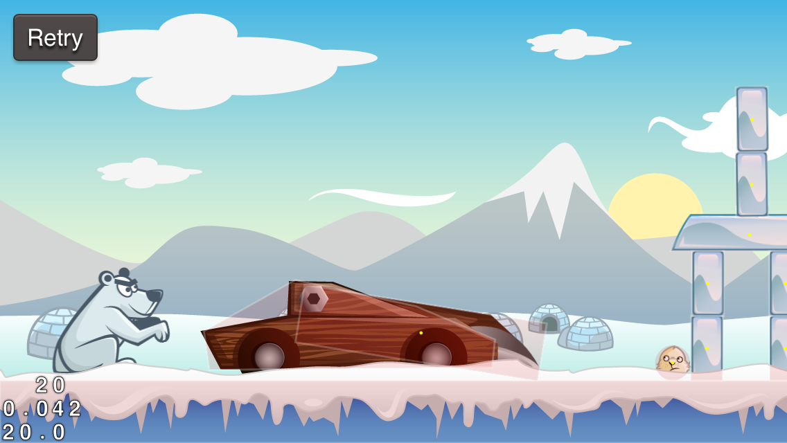

The catapult falls to the right because the physics body is larger there
(due to the bowl). Next, we are going to bring it back in it's default
upright position. *Also note that the shooting mechanism is broken,
because we changed the anchor point of the catapult arm. That is ok for
now, we are going to fix it soon.*

Pulling the catapult arm upright
================================

If you haven't worked with physics in games before, there is one
important thing to know. While the physics simulation itself is quite
realistic, you often need tricks to make the game appear *more*
realistic.

Now you are going to learn how to apply such a trick to bring the
catapult in an upright position. We're going to create a joint between
an invisible node and our catapult arm!

**In Spritebuilder**

Open *Gameplay.ccb* in Spritebuilder. Drag a CCNode to the stage and
place it above the catapult. *Make sure it is a child of the
CCPhysicsNode*. Also create a code connection called *\_pullbackNode*:

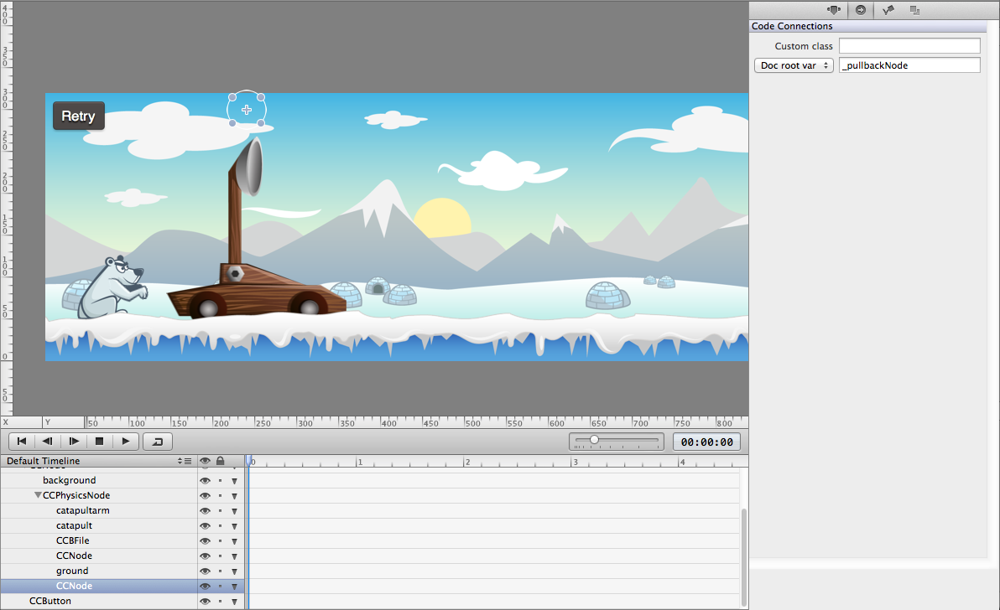

The node should be placed at (233.0, 285.0).
You also need to enable physics for this node, making it a static body
with no size (we just want this node to sit there and hold the catapult
arm):

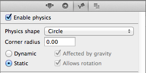

Now we need add a joint between the invisible node and the catpult arm. This joint wil hold the catapult arm in its upright position. For this connection we will be using a *Physics Spring Joint*, because as you will see later, this will be a loosely connected and not a very stiff joint. Select it from the Node Library and drag it to the stage. Since the *_pullbackNode* doesn't have a size, we need to drag the joint connection point to the timeline to connect to this node. We drag the second connection to the catapult arm:

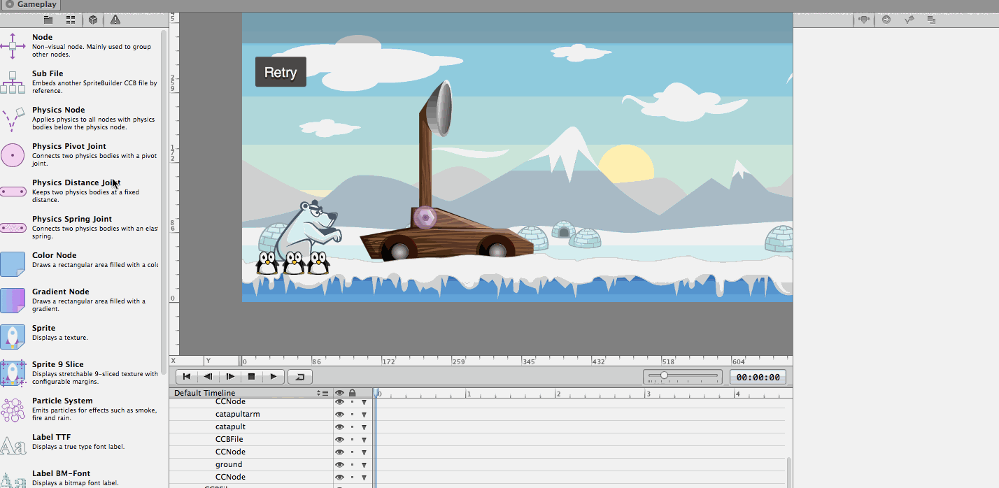

Now the spring joint is added, but you can see that is oddly placed. We want the joint to pull the catapult straight upwards, currently the joint between the catapult arm and our hidden node is skew. We can change the connection points between the ends of the joints and the physics bodies by changing the *anchor point* values of the joint. This can be either done by dragging the ends of the joint visually on the stage, or by setting the values explicitly in the inspector on the right. For this tutorial we are going to provide the values for you, to ensure we experience the same results. Select the spring joint and enter the following values on the right panel:

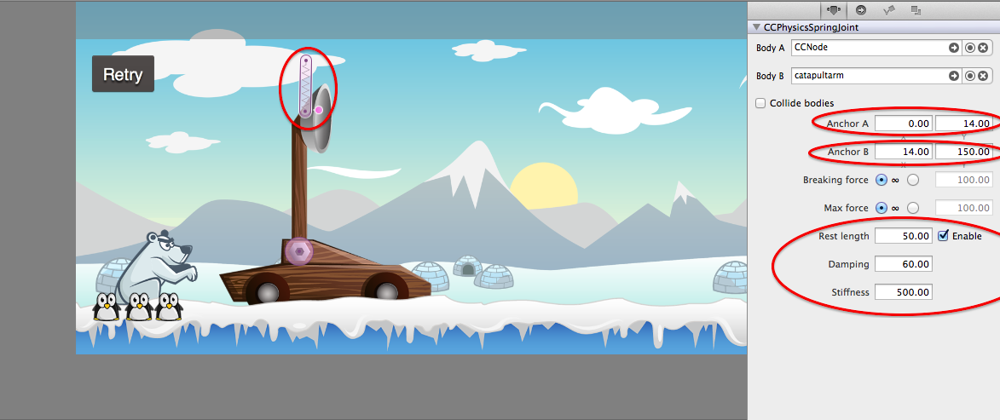

So here's what happening when you set all of these values. First we are setting the anchor points, that simply changes the two end points of the joint. Next, we are enabling a setting called *Rest length* by checking the *enabled* checkbox. Then we set the *Rest length* to *50.00*. The rest length defines the length the spring joint wants to expand or contract to. With *50.00* we are choosing a rest length that is a little bit smaller than the distance between our hidden node and the catapult arm. That leads to a small amount of tension on the spring joint which pulls the catapult arm in the upright position. Finally we set *Damping* to *60.00* and *Stiffness* to *500.00*. You find the appopriate values for these two properties by trying different values and testing the gameplay, for this tutorial you can go with the values that we figured out for you!

Now it's time to publish your SpriteBuilder project again and open Xcode.

**In Xcode**

Open *Gameplay.m* and once again create a member variable for the code connection
(*\_pullbackNode*) we created in SpriteBuilder. You wonder why we needed this code connection in the first place? The node that pulls the capult back is invisible and we also don't want it to collide with any other physics object in our game. A property called *collisionMask* allows us to choose with which objects our physics object will collide. If we set the *collisionMask* to an empty array, our object won't collide with any other objects in the game (SpriteBuilder allows editing the *collisionMask* but as of v1.1 it is not yet possible to set an empty collision mask).

We are going to set the *collisionMask* inside of *didLoadFromCCB*.
Add these lines to *didLoadFromCCB* to deactivate collisions for the *_pullbackNode*:

    // nothing shall collide with our invisible nodes
    _pullbackNode.physicsBody.collisionMask = @[];

Your result should be similar to this one:

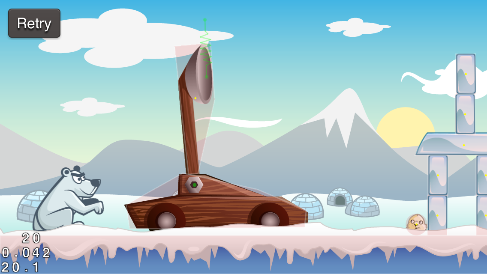

Now you have added the first artificial, invisible, physical force to
your game! As you can imagine, a lot of cool effects can be implemented
using this kind of joints.

Implement shooting by dragging the catapult arm
===============================================

Now we are going to implement the core mechanic of the game. We want the
player to be able shoot penguins by dragging the catapult arm back and
letting it snap.

**Do you have any ideas how we could implement this?**

Just as in the last section, we are going to use a hidden physics node
and a physics joint to connect the hidden node to the catapult arm. This time however, we will create the physics joint in code and not in SpriteBuilder. We can only create joints in SpriteBuilder when they exist throughout the entire game. If we need to create / destroy joints dynamically we need to do that in code.

Let's start implementing this feature in SpriteBuilder. **Create another hidden CCNode, just as you did in the last section for the _pullbackNode** and create a code connection with the variable name *\_mouseJointNode* (*mouseJoint* is
a common name for a drag&drop joint*). The position of this *_mouseJointNode* does not matter, since we will be moving it in code. When you finished all the steps, publish your project.

Open Xcode and add these two member variables to *Gameplay.m*:

    CCNode *_mouseJointNode;
    CCPhysicsJoint *_mouseJoint;

The basic Dragging concept
==========================

Here's a short outline of what we are going to do:

-   if a player starts touching the catapult arm, we create a
    springJoint between the mouseJointNode and the catapultArm
-   whenever a touch moves, we update the position of the mouseJointNode
-   when a touch ends we destroy the joint between the mouseJointNode
    and the catapultArm so that the catapult snaps and fires the penguin

Putting it into code
====================

First of all, add this line to *didLoadFromCCB* to deactivate collisions
for this invisible node:

    _mouseJointNode.physicsBody.collisionMask = @[];

**When a touch begins**

We are going to **replace** the complete *touchBegan* implementation.
This is the new one:

    -(void) touchBegan:(UITouch *)touch withEvent:(UIEvent *)event
    {
        CGPoint touchLocation = [touch locationInNode:_contentNode];

        // start catapult dragging when a touch inside of the catapult arm occurs
        if (CGRectContainsPoint([_catapultArm boundingBox], touchLocation))
        {
            // move the mouseJointNode to the touch position
            _mouseJointNode.position = touchLocation;

            // setup a spring joint between the mouseJointNode and the catapultArm
            _mouseJoint = [CCPhysicsJoint connectedSpringJointWithBodyA:_mouseJointNode.physicsBody bodyB:_catapultArm.physicsBody anchorA:ccp(0, 0) anchorB:ccp(34, 138) restLength:0.f stiffness:3000.f damping:150.f];
        }
    }

When a touch inside the catapult arm occurs, we move the mouseJointNode
to that position and set up a joint that will drag the catapult arm
around. As you can see setting up a physics joint in code is not too complicated either. You use the *CCPhysicsJoint* class and one of the available class initializers to create a joint. As soon as the joint is initialized it automatically becomes part of the active scene. As you can see you get to set the exact same parameters for the joint that you can adjust in SpriteBuilder. We choose an anchor point that matches the bowl of the catapult. Once again - the values for *stiffness* and *damping* are mostly determined experimental. You can use ours or find out if other ones work better for you.

**When a touch moves**

Whenever a touch moves, we need to update the position of the
mouseJointNode, so that the catapult arm is dragged in the correct
direction. We can do this by implementing the *touchMoved* method:

    - (void)touchMoved:(UITouch *)touch withEvent:(UIEvent *)event
    {
        // whenever touches move, update the position of the mouseJointNode to the touch position
        CGPoint touchLocation = [touch locationInNode:_contentNode];
        _mouseJointNode.position = touchLocation;
    }

**When a touch ends**

When a touch ends we want to destroy our joint and let the catapult
snap. Because we will need this code in two places, we are creating a
new method for it:

    - (void)releaseCatapult {
        if (_mouseJoint != nil)
        {
            // releases the joint and lets the catapult snap back
            [_mouseJoint invalidate];
            _mouseJoint = nil;
        }
    }

Now we are going to call this method from the *touchEnded* and
*touchCancelled* methods:

    -(void) touchEnded:(UITouch *)touch withEvent:(UIEvent *)event
    {
        // when touches end, meaning the user releases their finger, release the catapult
        [self releaseCatapult];
    }

    -(void) touchCancelled:(UITouch *)touch withEvent:(UIEvent *)event
    {
        // when touches are cancelled, meaning the user drags their finger off the screen or onto something else, release the catapult
        [self releaseCatapult];
    }

Now double check you have applied all changes correctly. Then run the
game and take a look at the results:

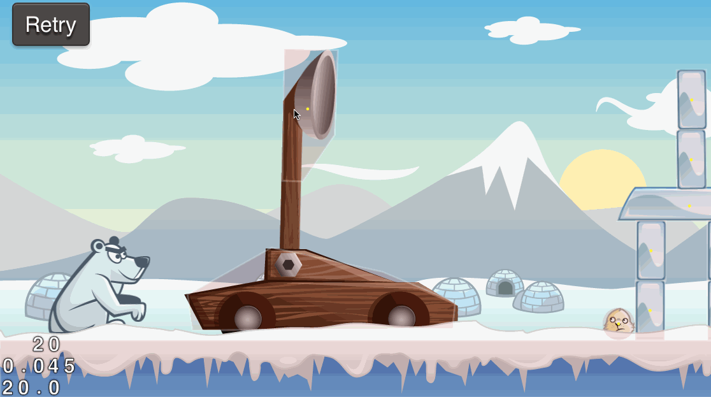

Great! Now you are really close to completing the shooting mechanism.
Move on to the next chapter to make these penguins fly.
